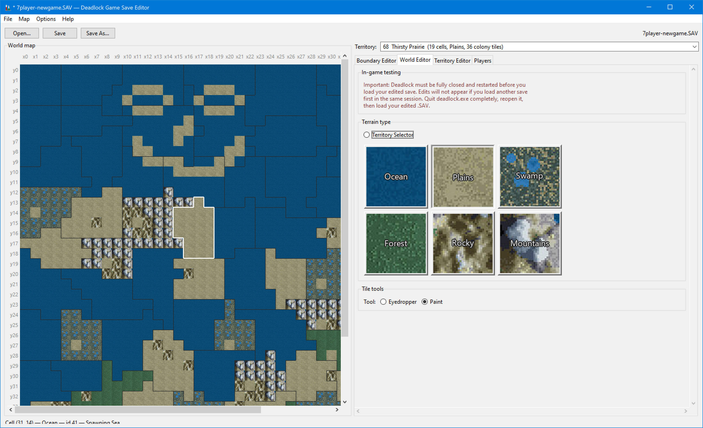
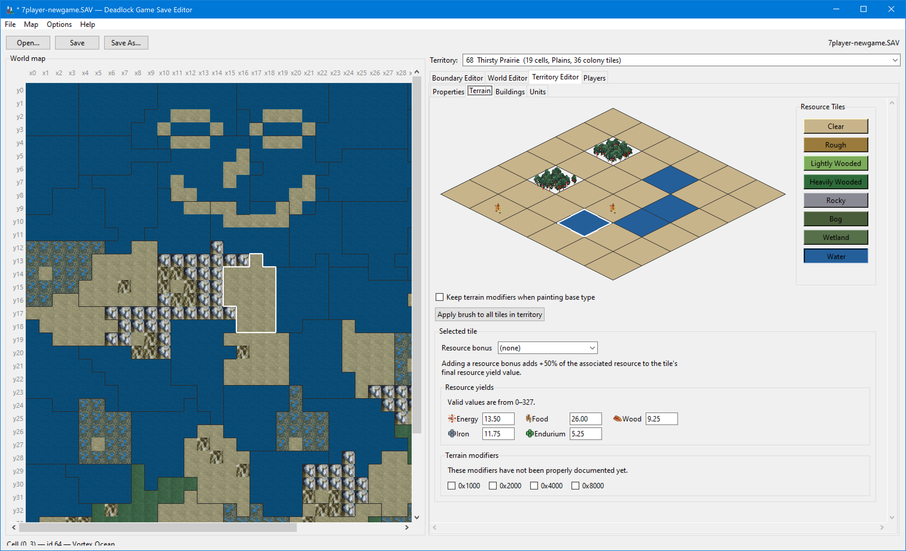
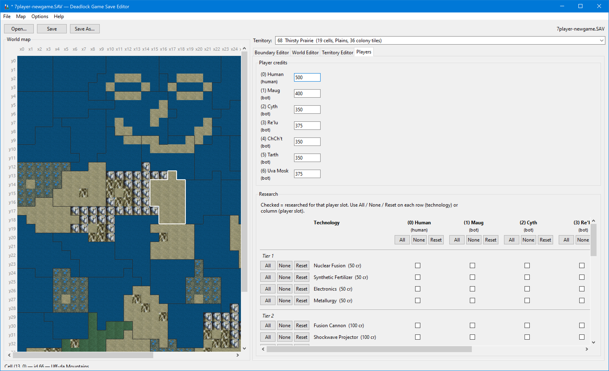

# Deadlock Tools - Game Save Editor

Unified editor for Deadlock v1.31 `.SAV` files: world map navigation, territory properties, and colony terrain tiles.

Combines the **Territory Boundary Editor** world map with the **Save Map Editor** colony tile painter in one window.

---

## Project goal — read this first

**Purpose:** edit a Deadlock save file, load it back into **Deadlock the game**, and see those edits **in-game**.

| | |
| --- | --- |
| **Deadlock (the game)** | What you launch (`deadlock.exe`). Final judge of whether an edit worked. |
| **`.SAV` file** | What we read and write. Bytes on disk that the game loads. |
| **This editor** | UI to view and patch saves. The map on the left is a **preview**, not the game renderer. |

An edit is only complete when it survives **save → load in Deadlock → verify in-game**. For **terrain sub-type / ground art**, quit Deadlock before loading the edited save (cold load). Fixing how the editor *draws* the map does not fix broken save data or in-game borders/terrain.

See also the repo root [README](../README.md#project-goal--read-this-first) and [SAVE_RESEARCH.md](../SAVE_RESEARCH.md) for byte-level format notes.

---

## Quick start (no Python required)

A pre-built Windows app is in the **`dist`** folder after you run `build.bat` (or use a release build).

1. Open **`dist`**.
2. Double-click **`GameSaveEditor.exe`**.
3. Click the splash image to continue.
4. Open a **copy** of your `.SAV` file (File → Open).

## Screenshots

**World map** — territory selection, world terrain painting, optional in-game tile sprites.



**Territory editor** — properties, colony **Terrain** tab (6×6 tiles, resource bonuses), stockpiles.



**Players** — per-slot credits and technology research grid.



## Run from source

Requires Python 3.10+ with Tkinter, Pillow, and `pefile`.

```bash
cd "Deadlock Tools - Game Save Editor"
pip install -r requirements.txt
python game_save_editor.py
python game_save_editor.py "..\Deadlock\base.sav"
```

Always work on a **copy** of your save.

## Rebuild the executable (developers)

```powershell
cd "Deadlock Tools - Game Save Editor"
pip install -r requirements.txt pyinstaller
build.bat
```

Output: `dist\GameSaveEditor.exe`. Place a source icon at `GameSaveEditor.png` in this folder (or use the generated `assets\GameSaveEditor.png` after the first build).

## Layout

**Left — World map**

- Territory dropdown above the map (click map cells or pick from the list)
- By default the map only **selects** territories
- Optional **Show grid u16[2] (debug)** colors each cell by its saved per-cell world-map value at grid `+0x04`. This is an editor visualization only — not in-game rendering. See `SAVE_RESEARCH.md` for what that field is (and is not).

**Right — Territory editor** (notebook)

- **Properties:** name, owner, land/water/swamp type, sub-type, stockpiles, cell count
- **Terrain:** 6×6 colony tile painter (territory record `+0x140` — separate from world-grid `u16[2]`)
- **Units:** placeholder (coming soon)

**Right — World Editor / Boundary Editor** (side notebook tabs)

- **World Editor:** paint strategic-map terrain sub-types on the world grid
- **Boundary Editor:** experimental territory reshape tools (enable via **Options** first)

**Right — Players tab**

- **Player credits:** per-slot credit balances (section 2 of the save)
- **Research:** technology checkboxes per player slot (same grid as the deprecated Research Editor)

## Boundary editing (off by default)

Territory reshaping is **experimental** and can break saves.

Enable it from **Options → Enable Boundary Editing (EXPERIMENTAL)**. That unlocks Paint / Eraser / Eyedropper tools on the world map and writes boundary changes on save.

Without that option, the editor only changes:

- Territory name, owner, and movement type
- Colony tile tables
- Player credits and technology research (Players tab)

## Testing terrain and sub-type edits in Deadlock

Sub-type changes (Plains → Mountains, Forest, etc.) are written to the save as grid bytes **`+0x04`/`+0x05`**. Deadlock only **rebuilds the world-map ground-art cache** on a **cold load** (quit the game completely, then load your edited save). Swapping saves **inside one session** leaves stale terrain pixels from the first load — even when the file on disk is correct.

| What you changed | In-session save swap | Cold load (quit → load edited save) |
| --- | --- | --- |
| Owner, name, movement type (border color) | Usually ✅ | ✅ |
| Territory boundaries | Usually ✅ | ✅ |
| Sub-type / ground art (mountains, forest, …) | ❌ Often stale | ✅ |

**Required workflow:** save from the editor → **quit Deadlock** → load the edited file — or make the edited save the **first** load of a new session. Do not load another save first if you are verifying ground texture.

Full RE detail (load paths, `0x4DD928`, `0x43F115`, test matrix): [SAVE_RESEARCH.md — Save load paths and terrain cache rebuild](../SAVE_RESEARCH.md#save-load-paths-and-terrain-cache-rebuild-confirmed-oct-2026).

## World Editor (terrain sub-type)

The **World Editor** tab and territory **Properties** sub-type fields rewrite grid cell **`u16[2]`** at **`+0x04`** (exposure low byte + profile high byte at **`+0x05`**) and territory record **`+0x21`/`+0x22`**. This matches how Deadlock stores strategic-map terrain on disk.

- **Save bytes:** encoded via the game’s **`0x43EBA3`** profile logic (see `world_gen_grid.py` in the deprecated Territory Boundary Editor folder).
- **In-game ground art:** requires a **cold load** (see above). The editor map preview is an approximation, not Deadlock’s renderer.
- **Borders vs fill:** movement type (**Water** / **Land** / **Swamp**) updates etched border color from record **`+0x22`** even on in-session swap; ground texture comes from a separate runtime cache.
- **Ocean / water fill:** native water cells use varied exposure bytes at **`+0x04`**; simple all-zero encoding may not match vanilla patterns — see [SAVE_RESEARCH.md](../SAVE_RESEARCH.md#base-watersav-experiment--encoding-vs-runtime-oct-2026).

See [SAVE_RESEARCH.md](../SAVE_RESEARCH.md) for byte layouts, world-gen RE, and the full cache pipeline.

## Save behavior

- **Normal mode:** patches territory metadata, colony tile tables, player credits, and research flags
- **Boundary mode:** also rewrites world-grid territory assignments and outline data (with validation warnings)

## Modules

| File | Purpose |
| --- | --- |
| `game_save_editor.py` | Main GUI |
| `map_view.py` | World map drawing helpers (debug coloring for grid u16[2]) |
| `terrain_catalog.py` | Terrain labels and presets |
| `territory_tiles.py` | Read/write colony tile rows |
| `deadlock_research_save.py` | Technology table parse/patch |
| `research_panel.py` | Players tab research grid UI |

Territory layout parsing uses `deadlock_territory_save.py` from `DEPRECATED - Deadlock Tools - Territory Boundary Editor`.

## Related tools

- **DEPRECATED - Research Editor** — standalone research GUI (merged into Players tab)
- **DEPRECATED - Territory Boundary Editor** — original boundary-only GUI (experimental)
- **DEPRECATED - Save Map Editor** — original colony-tile-only GUI
