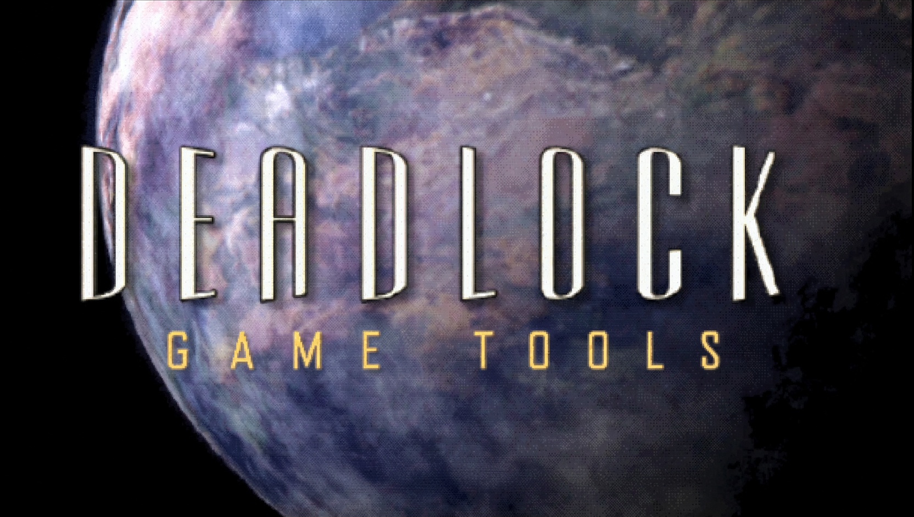
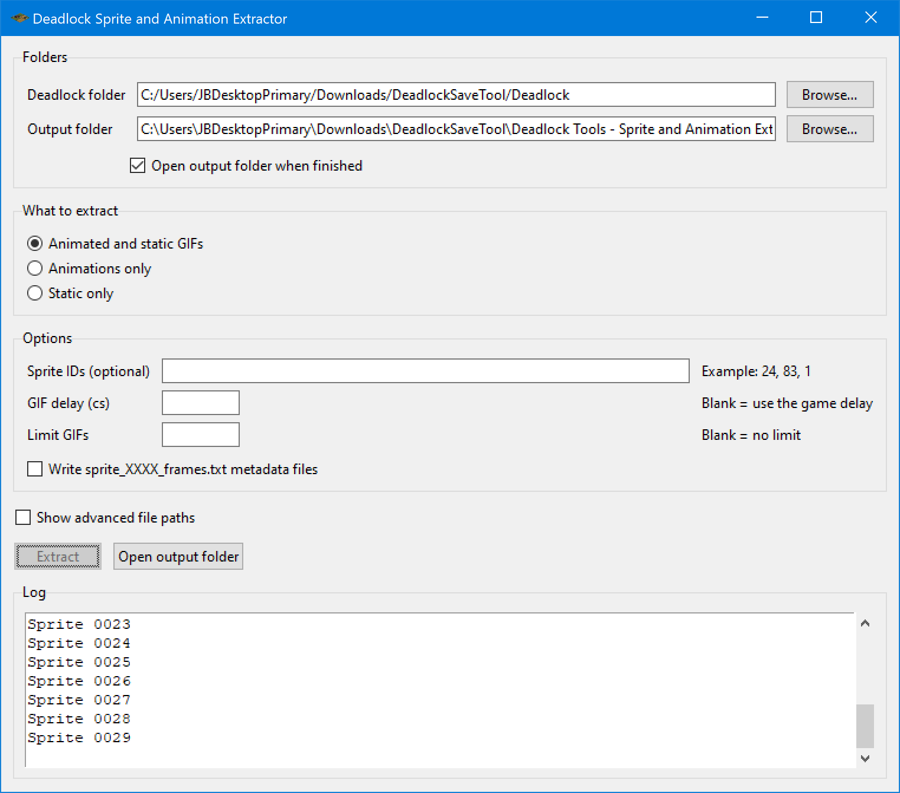
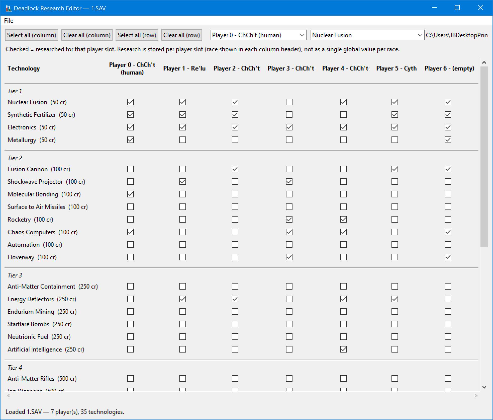
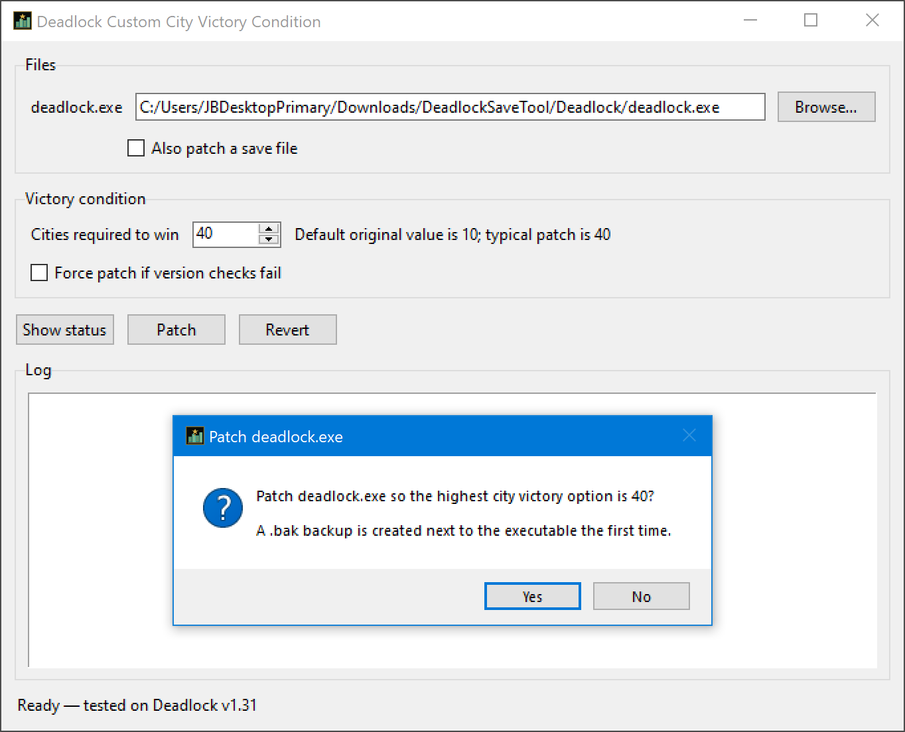

# Deadlock: Planetary Conquest Game Tools

Tools for *Deadlock: Planetary Conquest* (Accolade, 1996): asset extractors, save-game editors, and more.

Tested only on Windows 10 with Deadlock v1.31.

Each tool lives in its own folder. Windows users can run the pre-built `.exe` in that folder's `dist` directory. The Territory Boundary Editor is Python-only, **experimental**, and has **game-breaking bugs** — do not use it on a save you cannot replace.

| Tool | Folder |
| --- | --- |
| Sprite and Animation Extractor | [Deadlock Tools - Sprite and Animation Extractor](Deadlock%20Tools%20-%20Sprite%20and%20Animation%20Extractor) |
| Research Editor | [Deadlock Tools - Research Editor](Deadlock%20Tools%20-%20Research%20Editor) |
| Territory Boundary Editor (experimental, game-breaking bugs) | [Deadlock Tools - Territory Boundary Editor](Deadlock%20Tools%20-%20Territory%20Boundary%20Editor) |
| Custom City Victory Condition | [Deadlock Tools - Custom City Victory Condition](Deadlock%20Tools%20-%20Custom%20City%20Victory%20Condition) |

## Screenshots

**Sprite and Animation Extractor**

**Research Editor**

**Custom City Victory Condition**

Project home: https://sourceforge.net/projects/deadlock-game-tools

## License

See the license file in each tool folder when one is present. The Sprite and Animation Extractor is MIT.
